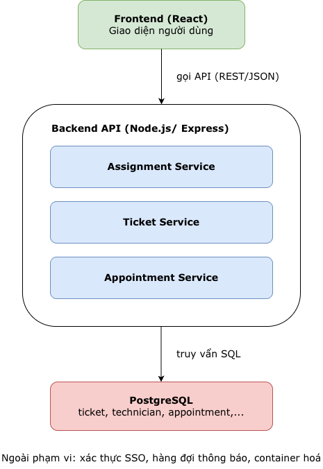
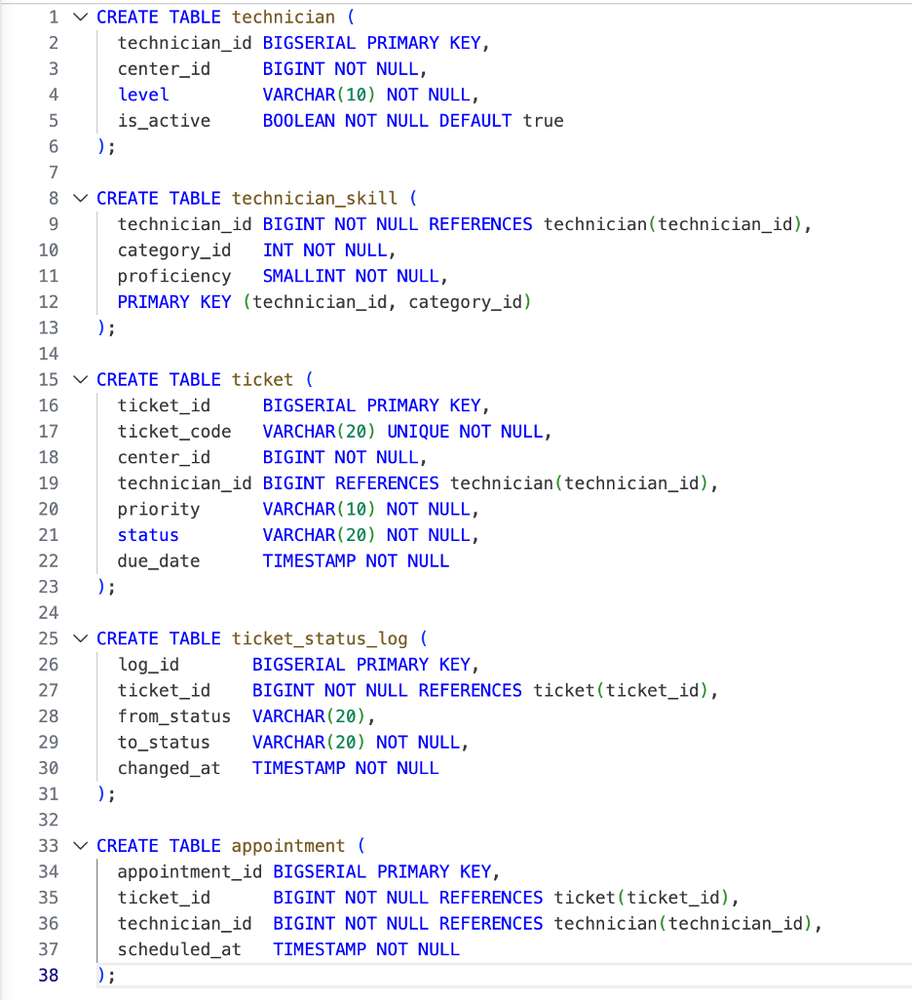
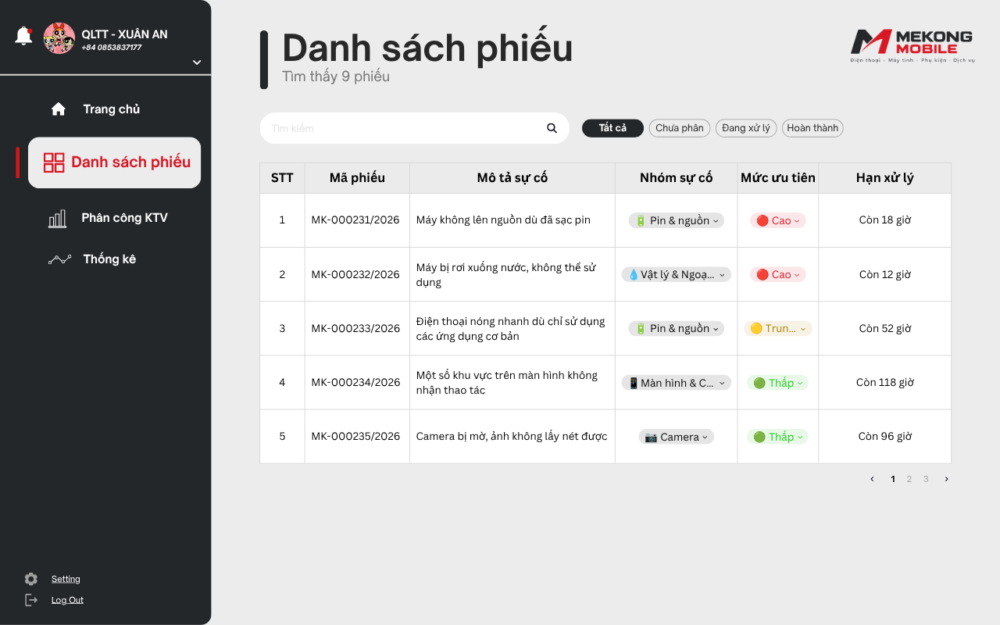
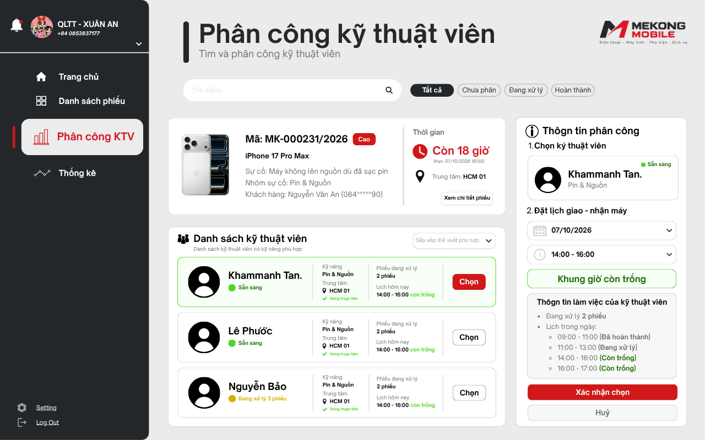
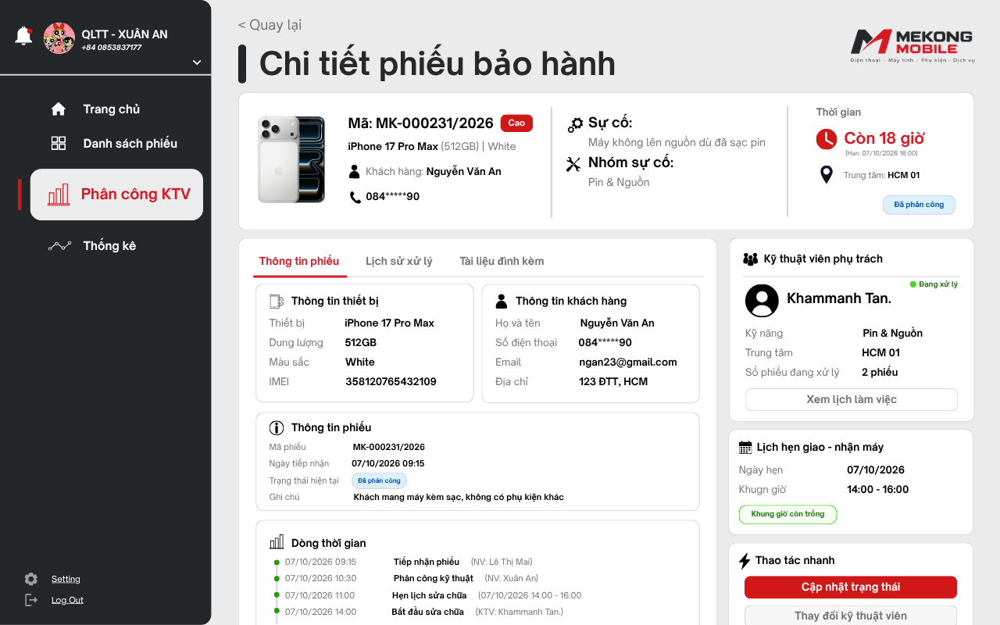

# BÁO CÁO BÀI TẬP 1

## MÔN CHUYÊN ĐỀ TỐT NGHIỆP 1

### Luồng 4: Phân công kỹ thuật viên và lịch hẹn (Track: SE)

**SVTH:** LUIBOUATHONG ANOPHONE

**MSSV:** 237480201IS01

**GVHD:** ThS. Nguyễn Minh Tân

# Chương 1: Tài liêu đặc tả yêu cầu (SRS)

## 1. Giới thiệu và phạm vi của doanh nghiệp

### 1.1. Bối cảnh doanh nghiệp

Cong ty cổ phần bán lẻ và dịch vụ Mekong Moblie hoạt động trong lĩnh vực bán lẻ các điẹn thoại di động, máy tính. Phụ kiện và cung cấp dịch vụ bảo hành sửa chữa. Công ty được thành lập năm 2025 và hiện tại đang có 24 cửa hàng bán lẻ tại TP.HCM, Cần Thơ và Hà Nội với 6 trung tâm bảo hành.

Công ty có khoảng 180 nhân viên gồm 38 kỹ thuật viên bảo hành và 12 nhân viên tiếp nhận. Mekong Mobile đã có khoảng 65,000 khách hàng đã mua hàng với dữ liệu đã ghi nhận rời rạc và chưa hợp nhất. Mỗi thàng công ty phát sinh được trung bình khoảng 900 dơn hàng và 260 yêu cầu bảo hành.

Do công ty vẫn phân công kỹ thuật viên hoàn toàn thư công theo trí nhứo của quản lý trugn tâm dẫn tới khối lượng công việc lệch nhau nghiêm trọng giữa các kỹ thuật viên khiến cho ban giảm đốc định hướng xây dựng hệ thống Smart CRM nhằm hợp nhất các dữ liệu khách hàng, số hoá quy trình bảo hành và cung cấp báo cáo điều hành trong 12 tháng sắp tới. Nhưng nguồn lực còn hạn chế, hệ thống được triển khai theo từng luồng nghiệp vụ cho nên bắt buộc phải thực hiện một luồng được lựa chọn và phê duyệt.

### 1.2. Luồng nghiệp vụ đã chọn

Phạm vi của đề tài sẽ tập trung vào việc “phân công kỹ thuật viên và lịch hẹn”. Luồng nghiệp vụ hỗ trợ việc quản lý trung tâm bảo hành xem danh sách phiếu chưa phân công và khối lượng công việc hiện tại của từng kỹ thuật viên phù hợp theo tay nghề và trugn tâm. Đồng thời, kỹ thuật viên cần cập nhật trạng thái phiều theo tốc độ xử lý, nhân viên tiếp nhận hẹn lịch hẹn giao – nhận máy với khách hàng và luồng sẽ kết thúc khi khách hàng nhận máy và phiếu sẽ được đóng.

### 1.3. Những chủ ý không cần làm (mức WON’T của MoSCoW)

- Không quản lý toàn bộ hệ thống Smart CRM của Mekong Mobile
- Không quản lý bán hàng và đơn hàng
- Không hiện thực chức năng tiếp nhận phiều bảo hành ban đầu (thuộc luồng số 2)
- Không quản lý tồn kho linh kiện (thuộc luồng số 5)
- Không khảo sát hài lòng sau khi đóng phiếu (thuộc luồng số 8)
- Không tối ưu hoá thuật toán phân công (thuộc luồng 4)

### 1.4. Bảng thuật ngữ nghiệp vụ trong tài liệu

| STT | Thuật ngữ | Định nghĩa | Tên kỹ thuật |
|---|---|---|---|
| 1 | Phiếu bảo hành | Một yêu cầu bảo hành/ sửa chữa được ghi nhận gồm mã phiếu duy nhất và vòng đời trạng thái | ticket |
| 2 | Trạgn thái phiếu | Vị trí hiện tại của phiếu trogn vòng đời (Mới/ Đã phân công/ Đang xử lý/ Chờ linh kiện/ Hoàn tất/ Đã đóng) | ticket_status |
| 3 | Kỹ thuật viên | Nhân viên thực hiện sửa chữa, có danh sách tay nghề và địa bàm làm việc | technician |
| 4 | Tay nghề | Mức thành thạo của kỹ thuật viên theo từng nhóm sự cố | technician_skill |
| 5 | Lịch hẹn | Khung thời gian đã hẹn giưa khách hàng và kỹ thuật viên để giao – nhận thiết bị | appointment |
| 6 | Hạn cam kết (SLA) | Thời điểm chậm nhất phải hoàn tất phiếu, tính từ lúc tiếp nhận phiếu theo mức ưu tiên | due_date |

# 2. Các biên liên quan

| Vài trò | Nhiệm vụ | Hạn chế |
|---|---|---|
| Quản lý trung tâm bảo hành | - Xem danh sách phiếu chưa phân công - Xem khối lượng cong việc của kỹ thuật viên - Phân công/ đổi kỹ thuật viên phù hợp (kèm lý do) - Xem tông quan trung tâm | - Không thể xem được dữ liệu của trugn tâm khác (QT-14) |
| Kỹ thuật viên | - Xem phiếu được phân công - Cập nhật trạng thái phiếu | - Không thể tự phân công phiếu (QT-08) |
| Nhân viên tiếp nhận | - Đặt lịch hẹn giao – nhận máy - Xác nhận khách nhận máy để đóng phiếu | - Không thể thay đổi phân cong kỹ thuật viên |

# 3. Yêu cầu chức năng

| Mã | Yêu cầu chức năng | MoSCoW |
|---|---|---|
| FR1 | Hiển thị và lọc danh sách phiếu bảo hành theo trạng thái (Chưa phân công / Đang xử lý / Hoàn tất); kỹ thuật viên chỉ thấy phiếu của mình, sắp theo hạn cam kết | MUST |
| FR2 | Gợi ý kỹ thuật viên phù hợp cho một phiếu: tay nghề ≥ 3 theo nhóm sự cố của phiếu, cùng trung tâm, kèm số phiếu đang xử lý | MUST |
| FR3 | Phân công kỹ thuật viên đã chọn cho phiếu, chuyển trạng thái sang Đã phân công và ghi log | MUST |
| FR4 | Đổi kỹ thuật viên phụ trách một phiếu và bắt buộc nhập lý do thay đổi; ghi log | SHOULD |
| FR5 | Kỹ thuật viên cập nhật trạng thái phiếu đúng thứ tự vòng đời; hệ thống tự ghi lịch sử chuyển trạng thái | MUST |
| FR6 | Đặt lịch hẹn giao – nhận máy; cảnh báo nếu trùng lịch của kỹ thuật viên | SHOULD |
| FR7 | Xác nhận khách hàng đã đến nhận máy để đóng phiếu | SHOULD |
| FR8 | Hiển thị tổng quan trung tâm: số phiếu theo trạng thái và số phiếu đang xử lý của từng kỹ thuật viên | COULD |

# 4. User Story

| Mã | User Story | MoSCoW |
|---|---|---|
| US1 | Là quản lý trung tâm, tôi muốn xem danh sách phiếu bảo hành của trung tâm mình để biết phiếu nào cần phân công. | MUST |
| US2 | Là quản lý trung tâm, tôi muốn lọc danh sách phiếu bảo hành theo trạng thái để nhanh chóng tìm đúng nhóm phiếu cần theo dõi. | SHOULD |
| US3 | Là quản lý trung tâm, tôi muốn phân công kỹ thuật viên phù hợp tay nghề và còn khối lượng công việc để phân công cho phiếu bảo hành để chia đều công việc và sửa đúng chuyên môn. | MUST |
| US4 | Là quản lý trung tâm, tôi muốn xem gợi ý kỹ thuật viên phù hợp để xem kỹ thuật viên nào phù hợp cho phếu. | SHOULD |
| US5 | Là quản lý trung tâm, tôi muốn đổi kỹ thuật viên phụ trách và ghi rõ lý do để có căn cứ tra soát khi cần. | SHOULD |
| US6 | Là quản lý trung tâm, tôi muốn ghi rõ lý do khi có thay đổi kỹ thuật viên phụ trách để có căn cứ tra soát khi cần. | SHOULD |
| US7 | Là kỹ thuật viên, tôi muốn xem các phiếu bảo hành được phân công sắp theo hạn cam kết để ưu tiên xử lý đúng thời hạn. | SHOULD |
| US8 | Là kỹ thuật viên, tôi muốn cập nhật trạng thái phiếu bảo hành để quản lý trung tâm biết tiến độ xử lý. | MUST |
| US9 | Là nhân viên tiếp nhận, tôi muốn đặt lịch hẹn giao – nhận máy để khách hàng biết thời điểm đến cửa hàng nhận máy. | SHOULD |
| US10 | Là nhân viên tiếp nhận, tôi muốn được cảnh báo khi lịch hẹn bị trùng để tránh hẹn hai khách cùng một thời điểm. | SHOULD |
| US11 | Là nhân viên tiếp nhận, tôi muốn xác nhận khách hàng đã nhận máy để đóng phiếu bảo hành và kết thúc quy trình bảo hành. | SHOULD |
| US12 | Là quản lý trung tâm, tôi muốn xem tổng quan số phiếu theo trạng thái và khối lượng của từng kỹ thuật viên để theo dõi số thống kê mỗi tháng. | COULD |

# 5. Yêu cầu phi chức năng

| Mã | Yêu cầu (có ngưỡng đo được) | Nhóm |
|---|---|---|
| NFR1 | Danh sách phiếu bảo hành của một trung tâm (tối đa 500 phiếu) hiển thị trong ≤ 2 giây ở phân vị 95 | Hiệu năng |
| NFR2 | Gợi ý kỹ thuật viên cho một phiếu trả kết quả trong ≤ 3 giây với tối đa 38 kỹ thuật viên | Hiệu năng |
| NFR3 | 100% yêu cầu truy cập dữ liệu của trung tâm khác bị từ chối (QT-14); 100% yêu cầu kỹ thuật viên tự phân công bị từ chối (QT-08) | Bảo mật |
| NFR4 | 100% thao tác phân công, đổi kỹ thuật viên, chuyển trạng thái được ghi log (người thực hiện, thời điểm), lưu ≥ 12 tháng | Truy vết |
| NFR5 | Hệ thống sẵn sàng ≥ 99% trong giờ làm việc 08:00 – 20:00 mỗi tháng | Khả dụng |

# 6. Ràng buộc và quy tắc nghiệp vụ

| Mã | Quy tắc nghiệp vụ | Luồng liên quan |
|---|---|---|
| QT-03 | Thiết bị được xác định duy nhất bằng số Serial hoặc IMEL. Một thiết bị chỉ thuộc về một khách hàng tại mộ thờ điểm. | L2, L4 |
| QT-04 | Hạn cam kết được sinh tự động từ thời gian điểm tiếp nhận theo độ ưu tiên: CAO = 24 tiếng, TRUNG_BINH = 72 tiếng và THAP = 120 tiếng (Tính theo ngày làm việc từ thứ Hai đến thứ Bảy) | L2, L4 |
| QT-06 | Phiếu chỉ được chuyển trạng thái theo đúng vòng đời, không được quay lại trạng thái trước. Mọi lần chuyển trạng thái đều phải ghi vào ticket_status_log | L2,L4,L5 |
| QT-07 | Một phiếu tại một thời điểm chỉ được gán cho tối đa một kỹ thuật viên. Việc đổi kỹ thuật viên phải được ghi lại kèm lý do. | L4 |
| QT-08 | Kỹ thuật viên chỉ được phân công phiếu thuộc nhóm sự cố mag mình có tay nghề (Proficiency ≥ 3) và cùng trugn tâm. | L4 |
| QT-13 | Không được xoá vật lý phiếu bảo hành, đơn hàng hay hồ sơ của khách hàng. Chỉ đánh dấu ngừng sử dụng (Soft delete) và giữ nguyên lịch sử. | Tất cả |
| QT-14 | - Nhân viên chỉ xem được dữ liệu của trung tâm hoặc cửa hàng mình đang làm việc - Quản lý xem được toàn bộ đơn vị mình phụ trách. - Ban giám đốc xem được toàn công ty | Tất cả |
| QT-15 | Số điện thoại khách hàng hiển thị dạnh che (ví dụ: 085*****77) với mọi vai trò trừ Quản lý và Ban giám đốc. | Tất cả |

# 7. Bảng truy vết yêu cầu

| FR | User Story | Use Case | MoSCoW |
|---|---|---|---|
| FR1 | US1, US2, US5 | UC1 | MUST |
| FR2 | US3 | UC2, UC3 | MUST |
| FR3 | US3 | UC2 | MUST |
| FR4 | US4 | UC4 | SHOULD |
| FR5 | US6 | UC5 | MUST |
| FR6 | US7, US8 | UC6 | SHOULD |
| FR7 | US9 | UC7 | SHOULD |
| FR8 | US10 | UC9 | COULD |

# Chương 2: Use Case Diagram

## 1. Danh sách Use Case

| Mã Use case | Actor | US liên quan |
|---|---|---|
| UC1 - Xem danh sách phiếu bảo hành | Quản lý trung tâm, Kỹ thuật viên | US1, US2, US5 |
| UC2 - Lọc danh sách theo trạng thái phiếu | Quản lý trung tâm | US1, US2 |
| UC3 - Phân công kỹ thuật viên cho phiếu | Quản lý trung tâm | US3, US4 |
| UC4 - Xem gợi ý kỹ thuật viên phù hợp | Quản lý trung tâm | US3, US4 |
| UC5 - Đổi kỹ thuật viên phụ trách | Quản lý trung tâm | US5 |
| UC6 - Ghi Log lý do thay đổi thuật viên phụ trách | Quản lý trung tâm | US4 |
| UC7 - Cập nhật trạng thái phiếu | Kỹ thuật viên | US6 |
| UC8 - Đặt lịch hẹn giao – nhận máy | Nhân viên tiếp nhận | US7, US8 |
| UC89 - Xác nhận khách nhận máy và đóng phiếu | Nhân viên tiếp nhận | US9 |
| UC10 - Xem tổng quan số phiếu và khối lượng công việc | Quản lý trung tâm | US10 |

## 2. Sơ đồ Use Case Diagram

File gốc: `docs/use-case-diagram.png`.

## 3. Đặc tả chi tiết Use Case quan trọng

### UC3: Phân công kỹ thuật viên phù hợp cho phiếu

- **Actor chính:** Quản lý trung tâm bảo hành
- **Mục tiêu:** Gán một kỹ thuật viên phù hợp cho phiếu để bắt đầu xử lý
- **Điều kiện trước:** Phiếu đang ở trạng thái Mới, chưa được phân công
- **Điều kiện sau:** Phiếu chuyển sang trạng thái Đã phân công, gắn với đúng một kỹ thuật viên, có ghi log

### 3.1. Luồng chính

1. Quản lý chọn một phiếu trong danh sách chưa phân công (từ UC1).
2. Hệ thống hiển thị chi tiết phiếu: mã phiếu, thiết bị, nhóm sự cố, hạn cam kết.
3. Quản lý yêu cầu xem gợi ý kỹ thuật viên (include UC4).
4. Hệ thống lọc kỹ thuật viên cùng trung tâm có tay nghề ≥ 3 theo nhóm sự cố, hiển thị kèm số phiếu đang xử lý, ít phiếu nhất lên đầu.
5. Quản lý chọn một kỹ thuật viên.
6. Quản lý xác nhận phân công.
7. Hệ thống kiểm tra phiếu vẫn ở trạng thái Mới.
8. Hệ thống gán kỹ thuật viên, chuyển phiếu sang Đã phân công và ghi log.
9. Hệ thống thông báo thành công và loại phiếu khỏi danh sách chưa phân công.

### 3.2. Luồng ngoại lệ (đánh số theo bước)

1. Phiếu thuộc trung tâm khác (QT-14): hệ thống từ chối truy cập, use case kết thúc.
2. Không có kỹ thuật viên đạt tay nghề ≥ 3 cùng trung tâm: hệ thống hiển thị "Không có kỹ thuật viên phù hợp", không cho xác nhận; use case kết thúc, phiếu giữ nguyên trạng thái Mới.
3. Quản lý hủy phiếu phân công: hệ thống quay về danh sách, không thay đổi dữ liệu.
4. Phiếu đã bị người khác phân công hoặc đổi trạng thái: hệ thống báo xung đột, tải lại danh sách, không ghi thay đổi.
5. Lỗi hệ thống khi lưu: hệ thống hoàn tác toàn bộ, phiếu giữ trạng thái Mới và báo lỗi cho quản lý.

# Chương 3: Thiết kế kiến trúc

## 1. Sơ đồ kiến trúc

File gốc: `docs/architecture.png`.

## 2. Những câu lập luận kiến trúc

### 1)

Dựa NFR1 hiệu năng: Vì NFR1 yêu cầu danh sách phiếu hiển thị dưới 2 giây với 500 bản ghi, tôi chọn đánh index trên cột (center_id, status) của bảng ticket và phân trang phía server, đánh đổi là phải thêm logic phân trang ở cả backend và frontend.

### 2)

Dựa NFR2 bảo mật: Vì NFR2 yêu cầu kỹ thuật viên chỉ xem được dữ liệu trung tâm mình và che số điện thoại, tôi chọn kiểm tra phân quyền ở tầng API (middleware) thay vì chỉ ở giao diện, đánh đổi là mỗi endpoint phải thêm bước kiểm tra quyền, tăng thời gian phát triển.

### 3)

Dựa NFR3 tin cậy: Vì NFR3 yêu cầu không mất thao tác khi mất kết nối, tôi chọn gộp việc cập nhật trạng thái và ghi log vào cùng một transaction CSDL, đánh đổi là phải xử lý rollback khi một bước thất bại, tăng độ phức tạp code.

# Chương 4: Mô hình dữ liệu (ERD, track SE)

## 1. ERD là gì

ERD là vẽ các bảng dữ liệu và cách chứng liên kết với nhau bằng khoá chính và khoá ngoại, mỗi bảng có khoá chính (PK), có ít nhất 2 quan hệ khoá ngoại (FK), không có bảng nào “mồ côi” (không liên kết với bảng nào khác).

Dưới đây là 5 bảng cho luồng 4:

| Bảng | Khoá chính (PK) | Khoá ngoại (FK) |
|---|---|---|
| ticket | ticket_id | technician_id → technician, center_id → service_center |
| technician | technician_id | center_id → service_center |
| technician | (technician_id, category_id) | technician_id → technician |
| appointment | Appointment_id | ticket_id → ticket, technician_id → technician |
| ticket_status_log | Log_id | ticket_id → ticket |

## 2. Mô hình SQL DDL

Sơ đồ ERD được xây dựng theo SQL DDL hiện tại.

File gốc: `docs/erd.png`.

# Chương 5: Thiết kế Wireframe

## 1. Màn hình Wireframe

### 1) Màn hỉnh 1. Danh sách phiếu

File gốc: `docs/wireframe1.png`.

### 2) Màn hình 2. Phân công kỹ thuật viên

File gốc: `docs/wireframe2.png`.

### 3) Màn hình 3. Chi tiết phiếu/ lịch hẹn

File gốc: `docs/wireframe3.png`.
