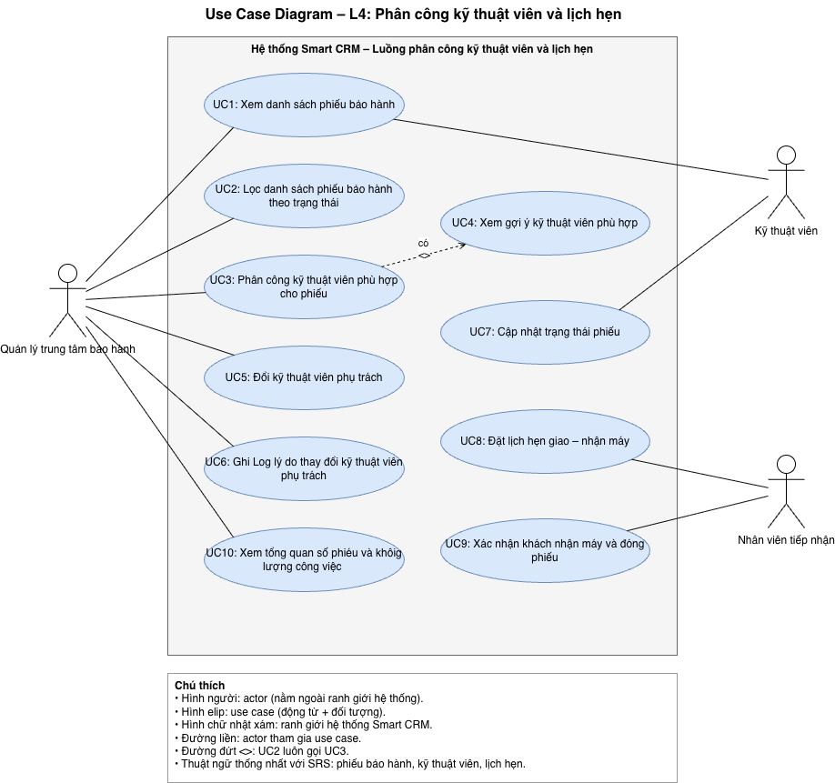

# SRS rút gọn – Smart CRM Mekong Mobile: Luồng "Phân công kỹ thuật viên và lịch hẹn"

- Sinh viên: LUIBOUATHONG ANOPHONE – MSSV 237480201IS01
- Môn: Chuyên đề tốt nghiệp 1 – Báo cáo buổi 4
- Track: SE

---

## 1. Giới thiệu và phạm vi doanh nghiệp

### 1.1 Bối cảnh doanh nghiệp

Công ty cổ phần bán lẻ và dịch vụ Mekong Mobile kinh doanh điện thoại di động, máy tính, phụ kiện và cung cấp dịch vụ bảo hành sửa chữa. Công ty thành lập năm 2025, có 24 cửa hàng tại TP.HCM, Cần Thơ, Hà Nội và 6 trung tâm bảo hành. Công ty có khoảng 180 nhân viên, trong đó 38 kỹ thuật viên bảo hành và 12 nhân viên tiếp nhận. Có khoảng 65.000 khách hàng với dữ liệu rời rạc, chưa hợp nhất. Mỗi tháng phát sinh trung bình khoảng 900 đơn hàng và 260 yêu cầu bảo hành.

Vấn đề hiện tại: quản lý trung tâm phân công kỹ thuật viên thủ công theo trí nhớ, khiến khối lượng công việc giữa các kỹ thuật viên lệch nhau nghiêm trọng. Ban giám đốc định hướng xây dựng hệ thống Smart CRM trong 12 tháng tới; do nguồn lực hạn chế, hệ thống triển khai theo từng luồng nghiệp vụ.

### 1.2 Luồng nghiệp vụ đã chọn

Phạm vi: **phân công kỹ thuật viên và lịch hẹn**. Quản lý trung tâm bảo hành xem danh sách phiếu bảo hành chưa phân công và khối lượng công việc của kỹ thuật viên để phân công theo tay nghề và trung tâm. Kỹ thuật viên cập nhật trạng thái phiếu bảo hành. Nhân viên tiếp nhận đặt lịch hẹn giao – nhận máy với khách hàng. Luồng kết thúc khi khách hàng nhận máy và phiếu bảo hành được đóng.

### 1.3 Ngoài phạm vi (mức WON'T)

- Không quản lý toàn bộ hệ thống Smart CRM.
- Không quản lý bán hàng và đơn hàng.
- Không hiện thực chức năng tiếp nhận phiếu bảo hành ban đầu (thuộc luồng số 2).
- Không quản lý tồn kho linh kiện (thuộc luồng số 5).
- Không khảo sát hài lòng sau khi đóng phiếu (thuộc luồng số 8).
- Không tối ưu hóa thuật toán phân công (thuộc luồng số 4).

### 1.4 Bảng thuật ngữ nghiệp vụ

Toàn bộ tài liệu, sơ đồ và API dùng đúng một tên cho mỗi khái niệm.

| STT | Thuật ngữ | Định nghĩa | Tên kỹ thuật |
|---|---|---|---|
| 1 | Phiếu bảo hành | Một yêu cầu bảo hành/sửa chữa được ghi nhận, có mã phiếu duy nhất và vòng đời trạng thái | `ticket` |
| 2 | Trạng thái phiếu | Vị trí hiện tại của phiếu trong vòng đời: Mới / Đã phân công / Đang xử lý / Chờ linh kiện / Hoàn tất / Đã đóng | `ticket_status` |
| 3 | Kỹ thuật viên | Nhân viên thực hiện sửa chữa, có danh sách tay nghề và địa bàn làm việc | `technician` |
| 4 | Tay nghề | Mức thành thạo (1–5) của kỹ thuật viên theo từng nhóm sự cố | `technician_skill` |
| 5 | Lịch hẹn | Khung thời gian đã hẹn giữa khách hàng và trung tâm để giao – nhận thiết bị | `appointment` |
| 6 | Hạn cam kết (SLA) | Thời điểm chậm nhất phải hoàn tất phiếu, tính từ lúc tiếp nhận theo mức ưu tiên | `due_date` |
| 7 | Khách hàng | Người sở hữu thiết bị gửi bảo hành; không trực tiếp dùng hệ thống trong luồng này *(cần đối chiếu mục 3 của case study)* | `customer` |

Quy ước trạng thái: Mới = `NEW`, Đã phân công = `ASSIGNED`, Đang xử lý = `IN_PROGRESS`, Chờ linh kiện = `WAITING_PARTS`, Hoàn tất = `COMPLETED`, Đã đóng = `CLOSED`. Khi lọc: "Chưa phân công" = `NEW`; "Đang xử lý" = `ASSIGNED`, `IN_PROGRESS`, `WAITING_PARTS`; "Hoàn tất" = `COMPLETED`, `CLOSED`.

---

## 2. Các bên liên quan

| Vai trò | Nhiệm vụ trong luồng | Hạn chế |
|---|---|---|
| Quản lý trung tâm bảo hành | Xem danh sách phiếu bảo hành chưa phân công; xem khối lượng công việc của kỹ thuật viên; phân công/đổi kỹ thuật viên (kèm lý do); xem tổng quan trung tâm | Không xem được dữ liệu của trung tâm khác (QT-14) |
| Kỹ thuật viên | Xem phiếu được phân công; cập nhật trạng thái phiếu | Không tự phân công phiếu (QT-08) |
| Nhân viên tiếp nhận | Đặt lịch hẹn giao – nhận máy; xác nhận khách nhận máy để đóng phiếu | Không thay đổi phân công kỹ thuật viên |
| Khách hàng (gián tiếp) | Đến nhận máy theo lịch hẹn | Không thao tác trên hệ thống trong luồng này |

---

## 3. Yêu cầu chức năng và User Story

### 3.1 Yêu cầu chức năng

| Mã | Yêu cầu chức năng | MoSCoW |
|---|---|---|
| FR1 | Hiển thị và lọc danh sách phiếu bảo hành theo trạng thái (Chưa phân công / Đang xử lý / Hoàn tất); kỹ thuật viên chỉ thấy phiếu của mình, sắp theo hạn cam kết | MUST |
| FR2 | Gợi ý kỹ thuật viên phù hợp cho một phiếu: tay nghề ≥ 3 theo nhóm sự cố của phiếu, cùng trung tâm, kèm số phiếu đang xử lý | MUST |
| FR3 | Phân công kỹ thuật viên đã chọn cho phiếu, chuyển trạng thái sang Đã phân công và ghi log | MUST |
| FR4 | Đổi kỹ thuật viên phụ trách một phiếu và bắt buộc nhập lý do thay đổi; ghi log | SHOULD |
| FR5 | Kỹ thuật viên cập nhật trạng thái phiếu đúng thứ tự vòng đời; hệ thống tự ghi lịch sử chuyển trạng thái | MUST |
| FR6 | Đặt lịch hẹn giao – nhận máy; cảnh báo nếu trùng lịch của kỹ thuật viên | SHOULD |
| FR7 | Xác nhận khách hàng đã đến nhận máy để đóng phiếu | SHOULD |
| FR8 | Hiển thị tổng quan trung tâm: số phiếu theo trạng thái và số phiếu đang xử lý của từng kỹ thuật viên | COULD |

### 3.2 User Story

| Mã | User Story | MoSCoW |
|---|---|---|
| US1 | Là quản lý trung tâm, tôi muốn xem danh sách phiếu bảo hành của trung tâm mình để biết phiếu nào cần phân công. | MUST |
| US2 | Là quản lý trung tâm, tôi muốn lọc danh sách phiếu bảo hành theo trạng thái để nhanh chóng tìm đúng nhóm phiếu cần theo dõi. | SHOULD |
| US3 | Là quản lý trung tâm, tôi muốn phân công kỹ thuật viên phù hợp tay nghề và còn khối lượng công việc để phân công cho phiếu bảo hành để chia đều công việc và sửa đúng chuyên môn. | MUST |
| US4 | Là quản lý trung tâm, tôi muốn xem gợi ý kỹ thuật viên phù hợp để xem kỹ thuật viên nào phù hợp cho phếu. | SHOULD |
| US5 | Là quản lý trung tâm, tôi muốn đổi kỹ thuật viên phụ trách và ghi rõ lý do để có căn cứ tra soát khi cần. | SHOULD |
| US6 | Là quản lý trung tâm, tôi muốn ghi rõ lý do khi có thay đổi kỹ thuật viên phụ trách để có căn cứ tra soát khi cần. | SHOULD |
| US7 | Là kỹ thuật viên, tôi muốn xem các phiếu bảo hành được phân công sắp theo hạn cam kết để ưu tiên xử lý đúng thời hạn. | SHOULD |
| US8 | Là kỹ thuật viên, tôi muốn cập nhật trạng thái phiếu bảo hành để quản lý trung tâm biết tiến độ xử lý. | MUST |
| US9 | Là nhân viên tiếp nhận, tôi muốn đặt lịch hẹn giao – nhận máy để khách hàng biết thời điểm đến cửa hàng nhận máy. | SHOULD |
| US10 | Là nhân viên tiếp nhận, tôi muốn được cảnh báo khi lịch hẹn bị trùng để tránh hẹn hai khách cùng một thời điểm. | SHOULD |
| US11 | Là nhân viên tiếp nhận, tôi muốn xác nhận khách hàng đã nhận máy để đóng phiếu bảo hành và kết thúc quy trình bảo hành. | SHOULD |
| US12 | Là quản lý trung tâm, tôi muốn xem tổng quan số phiếu theo trạng thái và khối lượng của từng kỹ thuật viên để theo dõi số thống kê mỗi tháng. | COULD |

### 3.3 Tiêu chí chấp nhận (Given–When–Then) cho story MUST

**US1 – Xem danh sách phiếu chưa phân công**

- **AC1.1** – Given quản lý trung tâm A đăng nhập và trung tâm A có 12 phiếu ở trạng thái Mới, When mở danh sách phiếu chưa phân công, Then hệ thống hiển thị đúng 12 phiếu gồm mã phiếu, nhóm sự cố, hạn cam kết, sắp theo hạn cam kết gần nhất.
- **AC1.2** *(ngoại lệ)* – Given trung tâm A không còn phiếu nào ở trạng thái Mới, When mở danh sách, Then hệ thống hiển thị "Không có phiếu chưa phân công".
- **AC1.3** *(ngoại lệ)* – Given quản lý trung tâm A, When yêu cầu xem phiếu của trung tâm B, Then hệ thống từ chối (QT-14) và không trả về dữ liệu.

**US3 – Phân công kỹ thuật viên**

- **AC3.1** – Given phiếu BH-000123 nhóm sự cố "Màn hình" ở trạng thái Mới, When quản lý mở gợi ý, Then danh sách chỉ gồm kỹ thuật viên cùng trung tâm có tay nghề Màn hình ≥ 3, kèm số phiếu đang xử lý, sắp xếp ít phiếu nhất lên đầu.
- **AC3.2** – Given quản lý đã chọn một kỹ thuật viên trong danh sách gợi ý, When xác nhận phân công, Then phiếu chuyển sang Đã phân công, gán đúng kỹ thuật viên và ghi log (người phân công, thời điểm).
- **AC3.3** *(ngoại lệ)* – Given không có kỹ thuật viên nào cùng trung tâm đạt tay nghề ≥ 3, When quản lý mở gợi ý, Then hệ thống hiển thị "Không có kỹ thuật viên phù hợp" và không cho xác nhận phân công.

**US6 – Cập nhật trạng thái phiếu**

- **AC6.1** – Given phiếu đang Đã phân công cho kỹ thuật viên K, When K chuyển sang Đang xử lý, Then trạng thái được cập nhật và hệ thống ghi lịch sử (trạng thái cũ, trạng thái mới, thời điểm).
- **AC6.2** *(ngoại lệ)* – Given phiếu đang Đã phân công, When kỹ thuật viên chuyển thẳng sang Hoàn tất, Then hệ thống từ chối và nêu thứ tự trạng thái hợp lệ tiếp theo.
- **AC6.3** *(ngoại lệ)* – Given phiếu được phân công cho kỹ thuật viên K, When kỹ thuật viên khác cố cập nhật phiếu này, Then hệ thống từ chối.

---

## 4. Yêu cầu phi chức năng

| Mã | Nhóm | Yêu cầu (có ngưỡng đo được) |
|---|---|---|
| NFR1 | Hiệu năng | Danh sách phiếu bảo hành của một trung tâm (tối đa 500 phiếu) hiển thị trong ≤ 2 giây ở phân vị 95 |
| NFR2 | Hiệu năng | Gợi ý kỹ thuật viên cho một phiếu trả kết quả trong ≤ 3 giây với tối đa 38 kỹ thuật viên |
| NFR3 | Bảo mật | 100% yêu cầu truy cập dữ liệu của trung tâm khác bị từ chối (QT-14); 100% yêu cầu kỹ thuật viên tự phân công bị từ chối (QT-08) |
| NFR4 | Truy vết | 100% thao tác phân công, đổi kỹ thuật viên, chuyển trạng thái được ghi log (người thực hiện, thời điểm), lưu ≥ 12 tháng |
| NFR5 | Khả dụng | Hệ thống sẵn sàng ≥ 99% trong giờ làm việc 08:00–20:00 mỗi tháng |

---

## 5. Use Case

### 5.1 Danh sách use case

| Mã | Use case | Actor | US liên quan |
|---|---|---|---|
| UC1 | Xem danh sách phiếu bảo hành | Quản lý trung tâm, Kỹ thuật viên | US1, US2, US5 |
| UC2 | Lọc danh sách theo trạng thái phiếu | Quản lý trung tâm | US1, US2 |
| UC3 | Phân công kỹ thuật viên cho phiếu | Quản lý trung tâm | US3, US4 |
| UC4 | Xem gợi ý kỹ thuật viên phù hợp | Quản lý trung tâm | US3, US4 |
| UC5 | Đổi kỹ thuật viên phụ trách | Quản lý trung tâm | US5 |
| UC6 | Ghi Log lý do thay đổi thuật viên phụ trách | Quản lý trung tâm | US4 |
| UC7 | Cập nhật trạng thái phiếu | Kỹ thuật viên | US6 |
| UC8 | Đặt lịch hẹn giao – nhận máy | Nhân viên tiếp nhận | US7, US8 |
| UC89 | Xác nhận khách nhận máy và đóng phiếu | Nhân viên tiếp nhận | US9 |
| UC10 | Xem tổng quan số phiếu và khối lượng công việc | Quản lý trung tâm | US10 |

### 5.2 Use Case Diagram

File gốc: `docs/diagrams/use-case-diagram.drawio`.

### 5.3 Đặc tả chi tiết UC2 – Phân công kỹ thuật viên cho phiếu

| Mục | Nội dung |
|---|---|
| Actor | Quản lý trung tâm bảo hành |
| Mục tiêu | Giao một phiếu bảo hành chưa phân công cho kỹ thuật viên phù hợp |
| Liên quan | US3; FR2, FR3 |
| Điều kiện trước | Quản lý đã đăng nhập; phiếu thuộc trung tâm của quản lý và đang ở trạng thái Mới |
| Điều kiện sau (thành công) | Phiếu ở trạng thái Đã phân công, gán đúng kỹ thuật viên, có log phân công |

**Luồng chính**

1. Quản lý chọn một phiếu trong danh sách chưa phân công (từ UC1).
2. Hệ thống hiển thị chi tiết phiếu: mã phiếu, thiết bị, nhóm sự cố, hạn cam kết.
3. Quản lý yêu cầu xem gợi ý kỹ thuật viên (include UC3).
4. Hệ thống lọc kỹ thuật viên cùng trung tâm có tay nghề ≥ 3 theo nhóm sự cố, hiển thị kèm số phiếu đang xử lý, ít phiếu nhất lên đầu.
5. Quản lý chọn một kỹ thuật viên.
6. Quản lý xác nhận phân công.
7. Hệ thống kiểm tra phiếu vẫn ở trạng thái Mới.
8. Hệ thống gán kỹ thuật viên, chuyển phiếu sang Đã phân công và ghi log.
9. Hệ thống thông báo thành công và loại phiếu khỏi danh sách chưa phân công.

**Luồng ngoại lệ (đánh số theo bước)**

- **2a** – Phiếu thuộc trung tâm khác (QT-14): hệ thống từ chối truy cập, use case kết thúc.
- **4a** – Không có kỹ thuật viên đạt tay nghề ≥ 3 cùng trung tâm: hệ thống hiển thị "Không có kỹ thuật viên phù hợp", không cho xác nhận; use case kết thúc, phiếu giữ nguyên trạng thái Mới.
- **6a** – Quản lý hủy phiếu phân công: hệ thống quay về danh sách, không thay đổi dữ liệu.
- **7a** – Phiếu đã bị người khác phân công hoặc đổi trạng thái: hệ thống báo xung đột, tải lại danh sách, không ghi thay đổi.
- **8a** – Lỗi hệ thống khi lưu: hệ thống hoàn tác toàn bộ, phiếu giữ trạng thái Mới và báo lỗi cho quản lý.

---

## 6. Bảng truy vết

| FR | User Story | Use Case | MoSCoW |
|---|---|---|---|
| FR1 | US1, US2, US5 | UC1 | MUST |
| FR2 | US3 | UC2, UC3 | MUST |
| FR3 | US3 | UC2 | MUST |
| FR4 | US4 | UC4 | SHOULD |
| FR5 | US6 | UC5 | MUST |
| FR6 | US7, US8 | UC6 | SHOULD |
| FR7 | US9 | UC7 | SHOULD |
| FR8 | US10 | UC9 | COULD |
